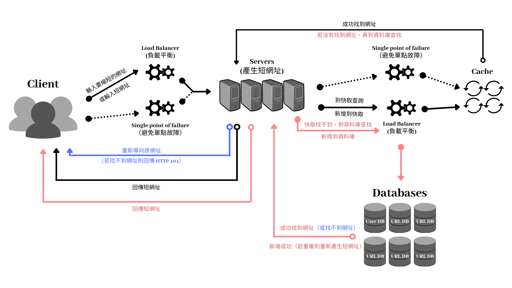

# 為什麼需要縮短網址？
許多開發者透過網址傳輸描述屬性，因此長連結過於複雜。

# 縮短網址有什麼好處？
方便使用者記憶及傳送網址的功能，部分網站提供自訂名稱以及密碼保護的功能，可以讓使用者取得更有自己風格的短網址。

# 縮短網址有什麼缺點？
縮短網址具有隱匿原始網址的特性，使用者無法透過短網址的「外觀」得知真實網址，因此短網址便成為有心人士利用來散播電腦病毒及有害內容的管道，成為近年來社交工程攻擊的慣用工具之一。
目前已經有部分短網址服務整合資訊安全廠商提供的網址檢查機制，提供使用者在點擊短網址時預覽真實網址以進行及安全性檢查，透過即時的檢查機制降低使用者暴露在資訊安全風險的機會。

# 短網址服務的後端系統架構圖
